# **Global vs Grid: A Comparative Study incase of Image Classification**

**V NIRANJANA (B23CH1046) JIGYASA TIWARI (B23EE1029)**

This project presents a comparative study of global versus grid-based feature extraction methods in image classification. Leveraging a fixed pretrained deep learning model, we extract features from both the entire image and from local grids within each image. 

These features are then evaluated using standard classifiers, allowing us to directly  compare  the  classification  accuracy  of  the  two  approaches.The objective is to determine which approach is better for visual recognition tasks.
# **Datasets Used :**
## **Oxford 102 Flower Dataset**

## **Flower Dataset Overview**
- Training Data: 6,552 images across 102 flower species (64 images/class on average)
- Validation  Data:  818  images  (8  images/class  average)  with  same  class structure
- Average size of the image : 224x224 pixels (sizes vary).
- Test Data: Unlabeled images for final predictions (exact count unspecified)
- cat\_to\_name.json: Maps numeric labels (1-102) to flower names

## **Animal Image Classification Dataset**

### **Animal Dataset Overview**
- #### 1000 images in each of the different animal classes
- Validation  Data:  818  images  (8  images/class  average)  with  same  class structure
- Image Resolution: Uniform 256x256 pixels for all images, ensuring clarity and consistency.
- #### File Format: JPG
- #### Color Space: RGB
# **Pretrained Model Used :**
The success of feature extraction hinges on using models pretrained on large- scale vision datasets. For this study, we leverage **Google's Vision Transformer (ViT-Base)**  pretrained  on  ImageNet-21k,  accessed  via  Hugging  Face's Transformers library. This model provides a robust foundation for both global and grid-based feature extraction without requiring task-specific training from scratch.

## **Key Components:**
## 1\.**ViTImageProcessor**
- Acts as the bridge between image data and machine learning models.
- Resizing: All images → 224×224 pixels

  Normalization: Pixel values scaled to [-1,1] using ImageNet mean/std

  2 Tensor Conversion: Outputs PyTorch tensors 

## **2.ViTModel**
- Used without classification head for pure feature extraction
- Outputs image embeddings from tensors, enabling classification, similarity analysis etc 

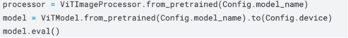
# **Feature Extraction Explained :**
Feature extraction is performed using a pretrained Vision Transformer (ViT) model  to  convert  raw  images  into  numerical  representations.  For  global features, the entire image is processed through ViT whereas for grid-based features,  the  image  is  split  into  tiles  (e.g.,  2×2  grids),  each  processed independently through ViT, with their [CLS] embeddings concatenated into a high-dimensional vector.

**Code Snippet**  

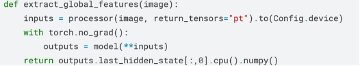

**Global Feature Extraction :** 

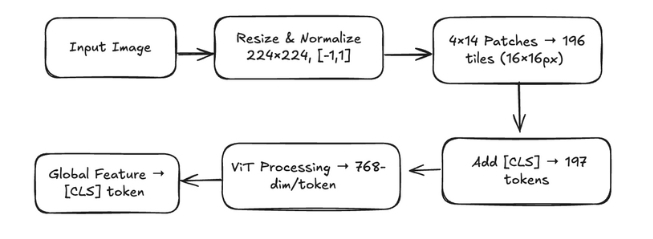

**Grid Feature Extraction :** 

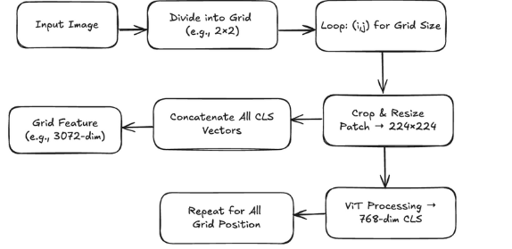

# **Code Execution in Flower Dataset :**

### feature extraction → classifier training → model evaluation

## Classifier Training:

### Base Models:
- **Logistic Regression** (max_iter=1000)
- **Decision Tree** (default params)

### Extended Models:
- **Support Vector Machine (SVM)**
- **Ridge Classifier**
- **Random Forest** (n_estimators=100)

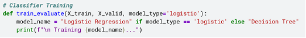

- The  classifiers  learn  to  associate  patterns  in  the  feature  vectors  with specific image classes during training.
- Once  trained,  the  models  are  evaluated  on  a  separate  validation  set  to measure how accurately they can predict the class of unseen images.

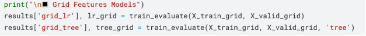

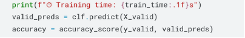

**Accuracies Obsereved :** 

|**Model**|**Training Time (s)**|**Validation Accuracy**|
| - | - | - |
|**Global + Logistic Regression**|53|99\.40%|
|**Global + Decision Tree**|46\.9|72\.50%|
|**Grid + Logistic Regression**|65\.8|99\.50%|
|**Grid + Decision Tree**|213|62\.00%|

**Visualisations :** 

  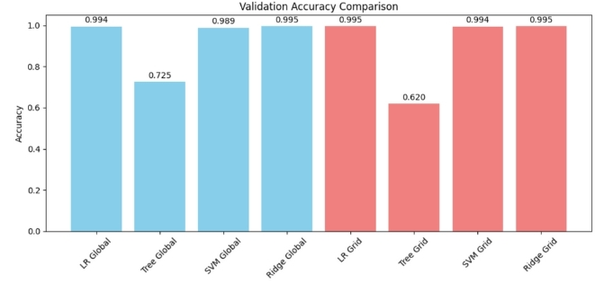

  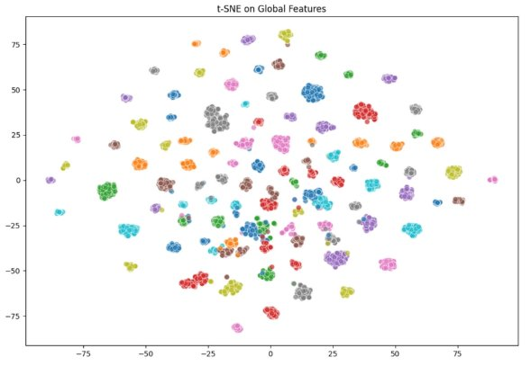

**Test Images predicted :** 

The first image on the left ->test image predicted.The next four images are reference samples  from  the  training  set  of  the  same  class,  visually  confirming  the  model's prediction.

  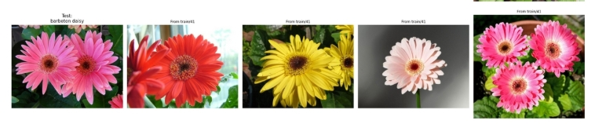

  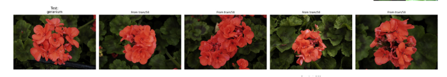

  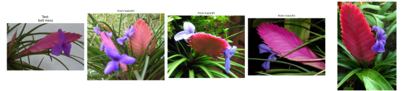

# **A Comparitive Study :**
## **Change in Dataset :**
- Using Animal Classification Dataset, smaller scale with low class counts to check computational efficiency.
- Used  the  same  pretrained  ViT  model  (google/vit-base-patch16-224)  and identical  2×2  grid  splitting  for  both  global  and  grid  feature  extraction methods
- Data loading manually splits class folders into train/test sets, unlike the previous  dataset’s  predefined  train/validation  folders  used  with torchvision.datasets.ImageFolder.
- Consistent Classifiers: Logistic Regression and Decision Trees

**Observations :** 

| Feature Type   | Classifier          | Validation Accuracy |
|----------------|---------------------|--------------------|
| Global         | Logistic Regression | 99.67%             |
| Global         | Decision Tree       | 95.22%             |
| Grid (2x2)     | Logistic Regression | 99.78%             |
| Grid (2x2)     | Decision Tree       | 91.56%             |

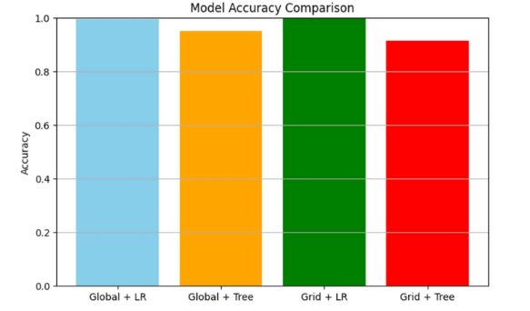 4

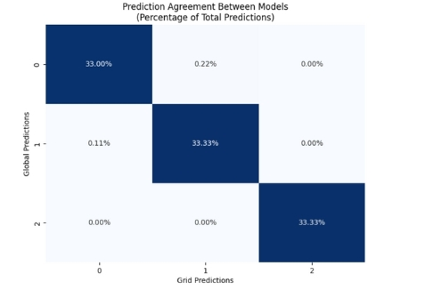

**Test Predictions:** 

  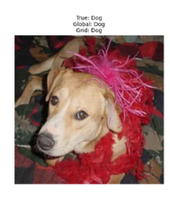
  
  

**Results Observed :** 

Across both datasets the accuracy difference b/w global and grid-based features remains minimal, reinforcing key insights about ViT’s feature extraction capabilities : 

- Logistic Regression validation accuracies for global and grid features are nearly identical,  showing  the  ViT  [CLS]  token  captures  rich  spatial  information compactly.
- Grid  features  increase  dimensionality  without  adding  meaningful  new information, often duplicating details in the [CLS] token.
- Logistic  Regression  performs  well  with  compact  global  features,  whereas Decision  Trees  struggle  with  high-dimensional,  sparse  space  created  by  grid features.
- ViT’s  patch-based  architecture  makes  explicit  grid-based  aggregation  largely redundant for this classification task. 4
